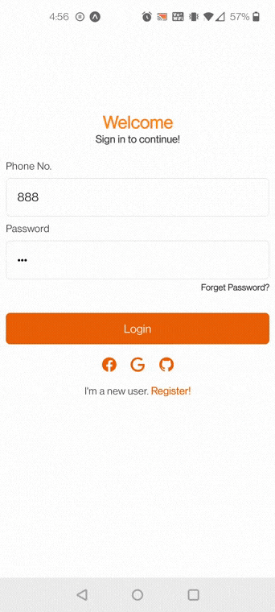
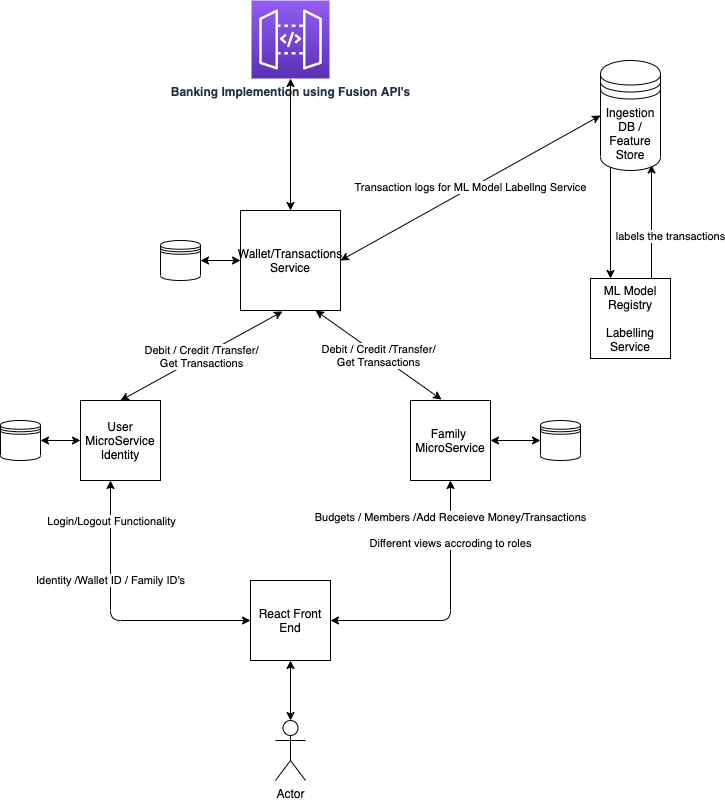
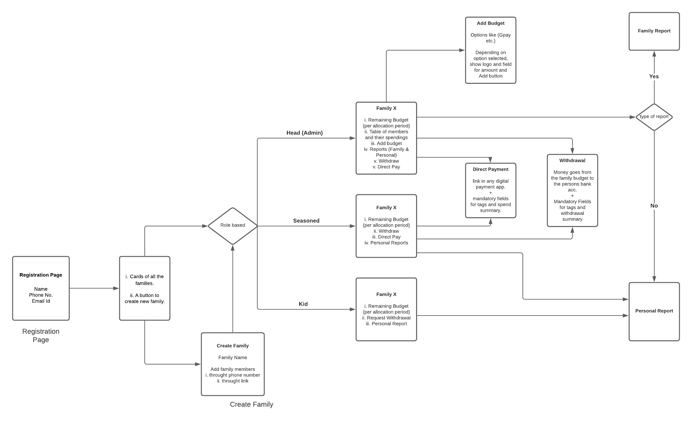
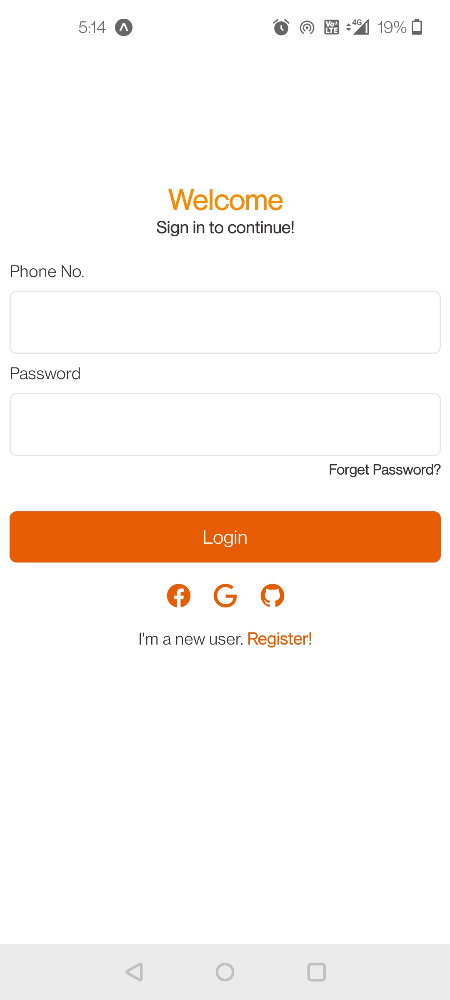
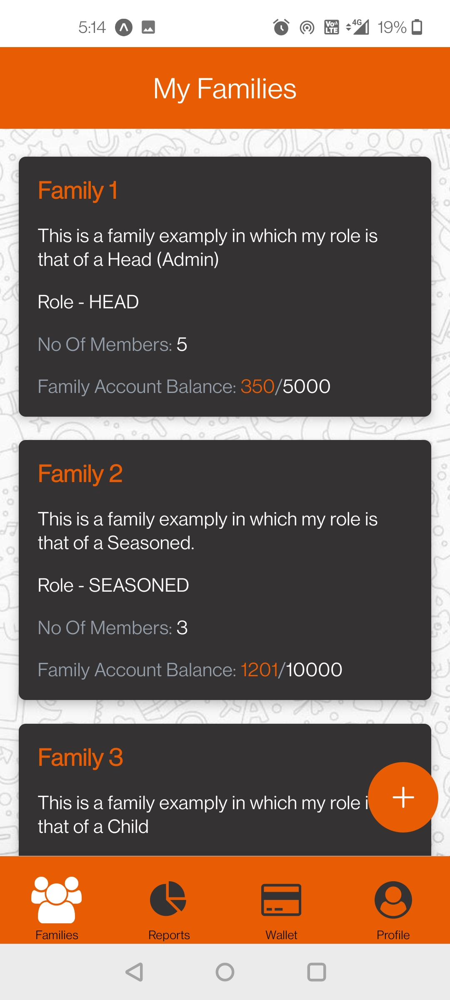
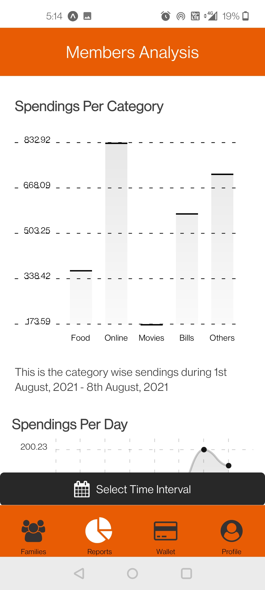
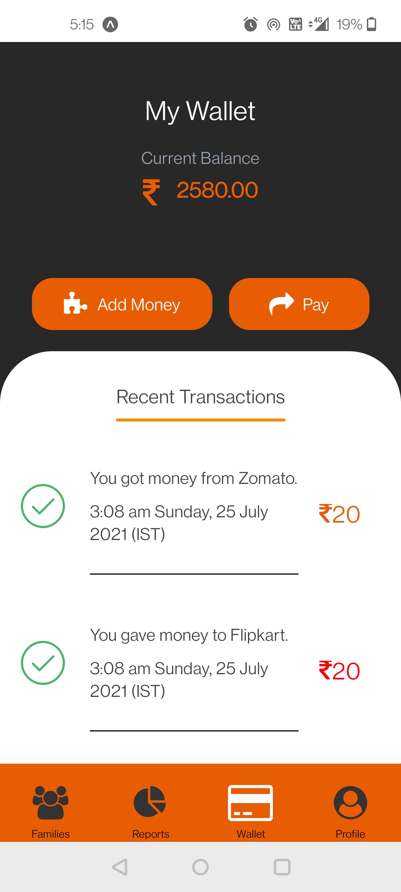
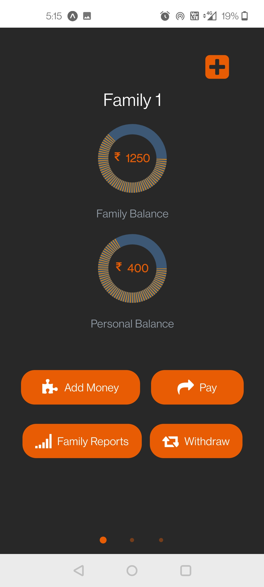
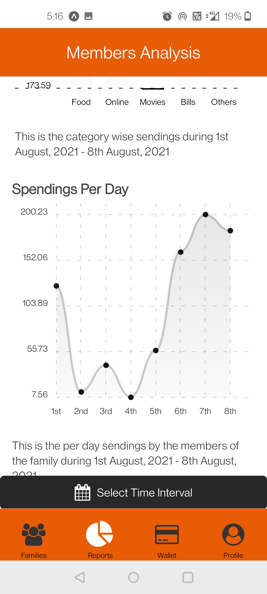

[![Contributors][contributors-shield]][contributors-url]
[![Forks][forks-shield]][forks-url]
[![Stargazers][stars-shield]][stars-url]
[![Issues][issues-shield]][issues-url]
[![MIT License][license-shield]][license-url]


<!-- PROJECT LOGO -->
<br />
<p align="center">
    <a href="https://github.com/BetaDryRun/Family-Budget-App">
        
    </a>

  <h3 align="center">Fay</h3>

  <p align="center">
    Your one-stop payment platform
    <br />
    <a href="#our-proposed-solution"><strong>Our Proposed Solution »</strong></a>
    <br />
    <br />
    <a href="https://github.com/BetaDryRun/Family-Budget-App">App Demo</a>
    ·
    <a href="https://github.com/BetaDryRun/Family-Budget-App/issues">Report Bug</a>
    ·
    <a href="https://github.com/BetaDryRun/Family-Budget-App/issues">Request Feature</a>
  </p>
</p>


<!-- TABLE OF CONTENTS -->
<details open="open">
    <summary>Table of Contents</summary>
    <ol>
        <li>
            <a href="#identifying-the-problem">Identifying the Problem</a>
        </li>
        <li>
            <a href="#our-proposed-solution">Our Proposed Solution</a>
            <ul>
                <li><a href="#fusion-api-by-zeta">Fusion API by Zeta</a></li>
            </ul>
             <ul>
                <li><a href="#system-architecture">System Architecture</a></li>
            </ul>
             <ul>
                <li><a href="#fusion-api-by-zeta">Fusion API by Zeta</a></li>
            </ul>
            <ul>
                <li><a href="#built-with">Built With</a></li>
            </ul>
            <ul>
                <li><a href="#app-workflow">App Workflow</a></li>
            </ul>
        </li>
        <li>
            <a href="#getting-started">Getting Started</a>
            <ul>
                <li><a href="#prerequisites">Prerequisites</a></li>
                <li><a href="#installation">Installation</a></li>
            </ul>
        </li>
        <li><a href="#screenshots">Screenshots</a></li>
        <li><a href="#important-links">Important Links</a></li>
        <li><a href="#license">License</a></li>
        <li><a href="#future-scope">Future Scope</a></li>
        <li><a href="#contact">Contact</a></li>
    </ol>
</details>


## Identifying the Problem

Families find it difficult to keep track of expenses and make guided decisions to make a proper monthly budget.
No way of accessing a consolidated view on exchanges done through different bank accounts/wallets.
No way to automatically categorize various transactions and visualize them from differing points-of-views.
Traditional ways of setting transaction limits and self-notes to control expenditures of varying nature are cumbersome and inflexible.
Planning for a whole months budget and adapting it to personal and time-variant needs on a family level is not straightforward.


<!-- ABOUT THE PROJECT -->
## Our Proposed Solution

<p align ="center">
    
</p>

We are providing these key features:

* Budget allocation for family based on categories such as entertainment, shopping, etc.
* Parental control on pocket money. Children can raise requests in order to spend money through family wallet
* Personal and family-level view of expenses based on time and type of expense
* Seamless transfer between bank account and wallets
* Analytical report generation on spendings

### Fusion API by Zeta

Fusion APIs used:
* /{accountId}/balance
* /issueBundle
* /newIndividual
* /transfers
* /{accountId}/transactions

### System Architecture

<!-- <p align="center">
  <a href="https://github.com/BetaDryRun/Family-Budget-App">
    
  </a>
</p> -->
<iframe frameborder="0" style="width:100%;height:804px;" src="https://viewer.diagrams.net/?highlight=0000ff&edit=_blank&layers=1&nav=1&title=Untitled%20Diagram.drawio#Uhttps%3A%2F%2Fdrive.google.com%2Fuc%3Fid%3D1KbESnBjR4GSIaV_onrWZhz0knbmzLsXl%26export%3Ddownload"></iframe>


### Built With

* [Fusion API by Zeta](https://fusion.tech/docs/)
* [Springboot](https://spring.io/projects/spring-boot)
* [React Native](https://reactnative.dev/)
* [MongoDB](https://www.mongodb.com/)
* Machine Learning


### App Workflow

<p align="center">
  <a href="https://github.com/BetaDryRun/Family-Budget-App">
    
  </a>
</p>

<!-- GETTING STARTED -->
## Getting Started

This is an example of how you may give instructions on setting up your project locally.
To get a local copy up and running follow these simple example steps.

### Prerequisites

You will need these preinstalled:
* yarn
  ```sh
  npm install --global yarn
  ```
* maven

### Installation

1. Clone the repo
   ```sh
   git clone https://github.com/BetaDryRun/Family-Budget-App.git
   ```
2. To run backend
   ```sh
   cd back-end/
   mvn clean install
   java -jar back-end-0.0.1-SNAPSHOT.jar
   ```
3. To run frontend
   ```sh
   cd front-end/
   yarn start
   ```


<!-- USAGE EXAMPLES -->
## Screenshots

<p float="left">
  
   
  
</p>
<p>
  
  
  
</p>

## Important Links

* <a href="http://localhost:8080/swagger-ui.html">Swagger Documentation</a>
* Demo


<!-- LICENSE -->
## License

Distributed under the MIT License. See `LICENSE` for more information.


## Future Scope

1. ML driven tagging of transaction. Custom tags can be created to personalize analytics.
2. Easy creation of “pot” for saving money towards a goal.
3. Giving recommendation on saving and investment.

<!-- CONTACT -->
## Contact

Team Name: DryRun

Project Link: [https://github.com/BetaDryRun/Family-Budget-App](https://github.com/BetaDryRun/Family-Budget-App)


<!-- MARKDOWN LINKS & IMAGES -->
<!-- https://www.markdownguide.org/basic-syntax/#reference-style-links -->
[repository-url]: https://github.com/BetaDryRun/Family-Budget-App
[contributors-shield]: https://img.shields.io/github/contributors/BetaDryRun/Family-Budget-App.svg?style=for-the-badge
[contributors-url]: https://github.com/BetaDryRun/Family-Budget-App/graphs/contributors
[forks-shield]: https://img.shields.io/github/forks/BetaDryRun/Family-Budget-App.svg?style=for-the-badge
[forks-url]: https://github.com/BetaDryRun/Family-Budget-App/network/members
[stars-shield]: https://img.shields.io/github/stars/BetaDryRun/Family-Budget-App.svg?style=for-the-badge
[stars-url]: https://github.com/BetaDryRun/Family-Budget-App/stargazers
[issues-shield]: https://img.shields.io/github/issues/BetaDryRun/Family-Budget-App.svg?style=for-the-badge
[issues-url]: https://github.com/BetaDryRun/Family-Budget-App/issues
[license-shield]: https://img.shields.io/github/license/BetaDryRun/Family-Budget-App?style=for-the-badge
[license-url]: https://github.com/BetaDryRun/Family-Budget-App/blob/master/LICENSE.txt
[product-screenshot]: images/screenshot.png